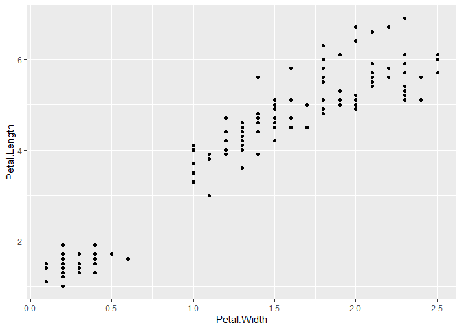
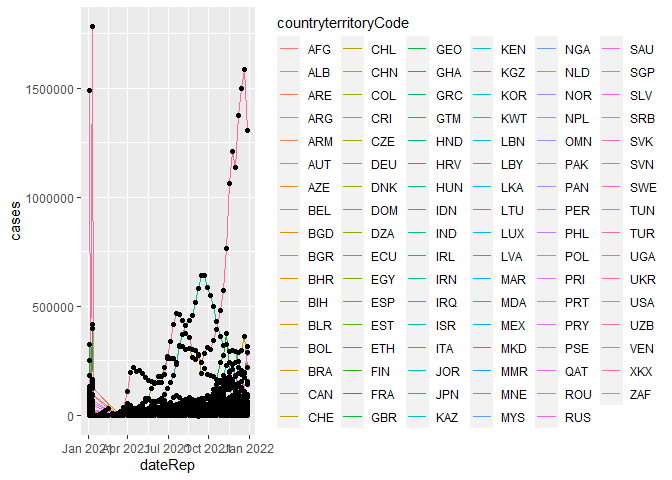

\#1. gganimate package \#2. transition\_*() \#3. ease\_aes() \#4.
enter\_* and exit\_\* animation configuration \#5. COVID\_19 data
animation

\#————————————- \# 1. gganimate package \#————————————

``` r
library(gganimate)
```

    ## Loading required package: ggplot2

    ## No renderer backend detected. gganimate will default to writing frames to separate files
    ## Consider installing:
    ## - the `gifski` package for gif output
    ## - the `av` package for video output
    ## and restarting the R session

``` r
#> Loading required package: ggplot2

#gganimate extends the grammar of graphics as implemented by ggplot2 to include the description of animation.
#It does this by providing a range of new grammar classes that can be added to the plot object
#in order to customise how it should change with time.

#transition_*() defines how the data should be spread out and how it relates to itself across time.
#view_*() defines how the positional scales should change along the animation.
#shadow_*() defines how data from other points in time should be presented in the given point in time.
#enter_*()/exit_*() defines how new data should appear and how old data should disappear during the course of the animation.
#ease_aes() defines how different aesthetics should be eased during transitions.

# We'll start with a static plot
p <- ggplot(iris, aes(x = Petal.Width, y = Petal.Length)) +
  geom_point()

#aes(colour = Species), size = 2

plot(p)
```

<!-- -->

``` r
#------------------------------------
# 2. transition_states()
#------------------------------------

anim <- p +
  transition_states(Species,
                    transition_length = 2,
                    state_length = 1)

#states
#   The unquoted name of the column holding the state levels in the data.
#transition_length
#   The relative length of the transition. Will be recycled to match the number of states in the data
#state_length
#   The relative length of the pause at the states. Will be recycled to match the number of states in the data
```

``` r
#--------------------------------------------
# 3. ease_aes(), Control easing of aesthetics
#--------------------------------------------

anim +
  ease_aes(y = 'bounce-out') # Sets special ease for y aesthetic
```

    ## Warning: No renderer available. Please install the gifski, av, or magick package
    ## to create animated output

    ## NULL

``` r
##ease_aes() animation type
#quadratic Models a power-of-2 function
#cubic Models a power-of-3 function
#quartic Models a power-of-4 function
#quintic Models a power-of-5 function
#sine Models a sine function
#circular Models a pi/2 circle arc
```

``` r
#exponential Models an exponential function
#elastic Models an elastic release of energy
#back Models a pullback and relase
#bounce Models the bouncing of a ball

#modifier
#-in The easing function is applied as-is
#-out The easing function is applied in reverse
#-in-out The first half of the transition it is applied as-is, while in the last half it is reversed

anim +
  ggtitle('Now showing {closest_state}',
          subtitle = 'Frame {frame} of {nframes}')
```

    ## Warning: No renderer available. Please install the gifski, av, or magick package
    ## to create animated output

    ## NULL

``` r
#-------------------------------------
# 4. Enter and exit animation
#-------------------------------------
#https://rdrr.io/github/thomasp85/gganimate/man/enter_exit.html

anim2 <- ggplot(iris, aes(x = Petal.Width, y = Petal.Length)) + 
  geom_point(aes(colour = Species)) + 
  transition_states(Species,
                    transition_length = 2,
                    state_length = 1)

anim2 +
  enter_fade() +
  exit_shrink()
```

    ## Warning: No renderer available. Please install the gifski, av, or magick package
    ## to create animated output

    ## NULL

``` r
anim2 +
  enter_fade() + enter_drift(x_mod = -1) +
  exit_shrink() + exit_drift(x_mod = 5)
```

    ## Warning: No renderer available. Please install the gifski, av, or magick package
    ## to create animated output

    ## NULL

``` r
#-------------------------------------
# Now lets combined all that we know
#------------------------------------
#Example 1 
ggplot(mtcars, aes(factor(cyl), mpg)) + 
  geom_boxplot() + 
  # Here comes the gganimate code
  transition_states(
    gear,
    transition_length = 2,
    state_length = 1
  ) +
  enter_fade() + 
  exit_shrink() +
  ease_aes('sine-in-out')
```

    ## Warning: No renderer available. Please install the gifski, av, or magick package
    ## to create animated output

    ## NULL

``` r
#Example 2
#install.packages("gapminder")
library(gapminder)

ggplot(gapminder,aes(x = gdpPercap, y=lifeExp, size = pop, colour = country)) +
  geom_point(show.legend = FALSE, alpha = 0.7) +
  scale_color_viridis_d() +
  scale_size(range = c(2, 12)) +
  scale_x_log10() +
  labs(x = "GDP per capita", y = "Life expectancy")+ 
  transition_time(year) +
  labs(title = "Year: {frame_time}")
```

    ## Warning: No renderer available. Please install the gifski, av, or magick package
    ## to create animated output

    ## NULL

``` r
#----------------------------------------------------------
# 5. Practical Data Plotting - Covid 19 Dataset
#----------------------------------------------------------
#https://www.ecdc.europa.eu/en/publications-data/download-todays-data-geographic-distribution-covid-19-cases-worldwide

library(utils)
COVID_19 <-  read.csv("https://opendata.ecdc.europa.eu/covid19/casedistribution/csv", na.strings = "", fileEncoding = "UTF-8-BOM")

COVID_19$cases <- COVID_19$cases_weekly
COVID_19$deaths <- COVID_19$deaths_weekly
COVID_19$dateRep <- as.Date(COVID_19$dateRep, tryFormats = c("%d/%m/%t"))

dim(COVID_19)
```

    ## [1] 9791   12

``` r
#11768    10

str(COVID_19)
```

    ## 'data.frame':    9791 obs. of  12 variables:
    ##  $ dateRep                                        : Date, format: "2021-01-11" "2021-01-04" ...
    ##  $ year_week                                      : chr  "2021-01" "2020-53" "2020-52" "2020-51" ...
    ##  $ cases_weekly                                   : int  675 902 1994 740 1757 1672 1073 1368 1164 606 ...
    ##  $ deaths_weekly                                  : int  71 60 88 111 71 137 68 69 61 24 ...
    ##  $ countriesAndTerritories                        : chr  "Afghanistan" "Afghanistan" "Afghanistan" "Afghanistan" ...
    ##  $ geoId                                          : chr  "AF" "AF" "AF" "AF" ...
    ##  $ countryterritoryCode                           : chr  "AFG" "AFG" "AFG" "AFG" ...
    ##  $ popData2019                                    : int  38041757 38041757 38041757 38041757 38041757 38041757 38041757 38041757 38041757 38041757 ...
    ##  $ continentExp                                   : chr  "Asia" "Asia" "Asia" "Asia" ...
    ##  $ notification_rate_per_100000_population_14.days: num  4.15 7.61 7.19 6.56 9.01 7.22 6.42 6.66 4.65 3.7 ...
    ##  $ cases                                          : int  675 902 1994 740 1757 1672 1073 1368 1164 606 ...
    ##  $ deaths                                         : int  71 60 88 111 71 137 68 69 61 24 ...

``` r
#tibble [11,768 x 10] (S3: tbl_df/tbl/data.frame)
#$ dateRep                : POSIXct[1:11768], format: "2020-04-19" "2020-04-18" "2020-04-17" "2020-04-16" ...
#$ day                    : num [1:11768] 19 18 17 16 15 14 13 12 11 10 ...
#$ month                  : num [1:11768] 4 4 4 4 4 4 4 4 4 4 ...
#$ year                   : num [1:11768] 2020 2020 2020 2020 2020 2020 2020 2020 2020 2020 ...
#$ cases                  : num [1:11768] 63 51 10 70 49 58 52 34 37 61 ...
#$ deaths                 : num [1:11768] 0 1 4 2 2 3 0 3 0 1 ...
#$ countriesAndTerritories: chr [1:11768] "Afghanistan" "Afghanistan" "Afghanistan" "Afghanistan" ...
#$ geoId                  : chr [1:11768] "AF" "AF" "AF" "AF" ...
#$ countryterritoryCode   : chr [1:11768] "AFG" "AFG" "AFG" "AFG" ...
#$ popData2018            : num [1:11768] 37172386 37172386 37172386 37172386 37172386 ...
#########################################################################################################

library(dplyr)
```

    ## 
    ## Attaching package: 'dplyr'

    ## The following objects are masked from 'package:stats':
    ## 
    ##     filter, lag

    ## The following objects are masked from 'package:base':
    ## 
    ##     intersect, setdiff, setequal, union

``` r
Totalcases_in_All_Countries <-
  COVID_19 %>% group_by(countriesAndTerritories) %>% summarise(Cases = sum(cases))
```

    ## `summarise()` ungrouping output (override with `.groups` argument)

``` r
COVID_19s <-
  COVID_19 %>% group_by(countryterritoryCode) %>% filter(sum(cases) > 30000)

COVID_19s <- COVID_19s[COVID_19s$dateRep>'2020-01-01',]

COVID_19s1 <- COVID_19s %>%
              group_by(countryterritoryCode) %>%
              arrange(dateRep) %>% 
              mutate(cum_deaths = cumsum(deaths))

COVID_19s2 <- COVID_19s1 %>%
              group_by(countryterritoryCode) %>%
              arrange(dateRep) %>% 
              mutate(cum_cases = cumsum(cases))

COVID_19s3 <- COVID_19s2 %>%
              group_by(countryterritoryCode) %>%
              arrange(dateRep) %>% 
              mutate(deathrate = cum_deaths/cum_cases*100)

COVID_19s3$deathrate[is.nan(COVID_19s3$deathrate)] <- 0
COVID_19s3$deathrate[is.infinite(COVID_19s3$deathrate)] <- 0
COVID_19s3$deathrate[COVID_19s3$deathrate>20] <- 0

COVID_19s3$countriesAndTerritories <- factor(COVID_19s2$countriesAndTerritories,
                                             levels = unique(COVID_19s2$countriesAndTerritories[COVID_19s2$dateRep>"2020-04-19"])[order(COVID_19s2$cum_cases[COVID_19s2$dateRep>"2020-04-19"])])
            

#Transition reveal only works in geom_line() and geom_area()
cv2 <- ggplot(COVID_19s3, aes(x = dateRep, y = cases))
cv2 + geom_line(aes(color = countryterritoryCode)) + geom_point()
```

<!-- -->

``` r
cv2 + geom_line(aes(color = countryterritoryCode)) + geom_point() + transition_reveal(dateRep) 
```

    ## Warning: No renderer available. Please install the gifski, av, or magick package
    ## to create animated output

    ## NULL

``` r
cv3 <- ggplot(COVID_19s3, aes(x = countriesAndTerritories, y = cum_cases))
cv4 <- cv3 + geom_col(aes(fill = deathrate)) + coord_flip() + transition_time(dateRep) + scale_y_log10() +
        ggtitle('Now showing {frame_time}',subtitle = 'Frame {frame} of {nframes}') + theme(text = element_text(size=20))

animate(cv4, nframes= 240, fps=12, height = 480, width = 480)
```

    ## Warning: No renderer available. Please install the gifski, av, or magick package
    ## to create animated output

``` r
#anim_save("Covid Total Animation.mp4", animation = last_animation())
```
